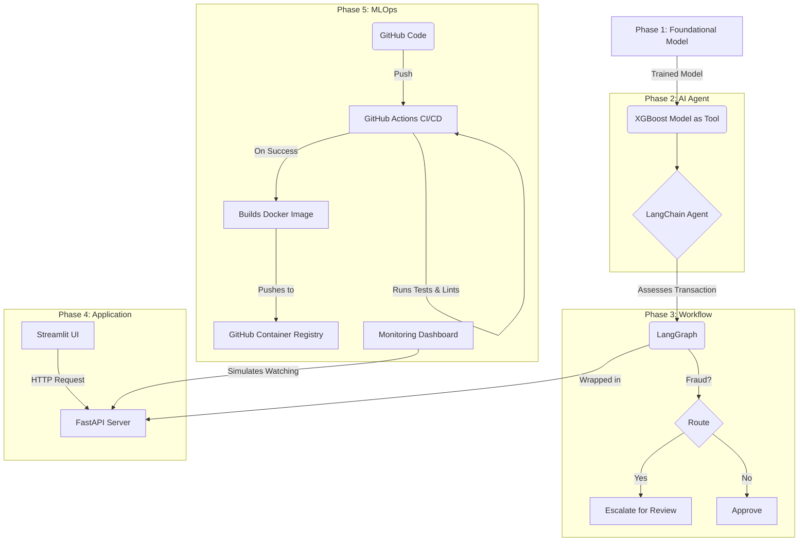

# Project Sentinel: End-to-End AI-Powered Risk Assessment Platform

## 1. Introduction
**Project Sentinel** is a complete, end-to-end demonstration of building, deploying, and monitoring a sophisticated AI system.  
It simulates a real-world fintech use case: **assessing credit card transactions for fraud risk**.  

The project moves beyond a simple model in a notebook to a production-ready system, showcasing the **full lifecycle of an AI product** from foundational modeling to MLOps.

This project was built to demonstrate a **strategic and hands-on approach to AI platform development**, covering everything from model training and agent-based AI to API deployment and automated CI/CD.

---

## 2. What This Project Demonstrates
This portfolio piece showcases the ability to:

- **Own AI Strategy & Execution**: From a foundational model to a multi-agent workflow and a production-ready API.
- **Integrate Traditional ML with LLMs**: Wrapping a powerful XGBoost model into an intelligent LangChain and LangGraph agent-based system.
- **Build for Production**: Containerizing the application with Docker and exposing it via a FastAPI backend.
- **Champion MLOps Best Practices**: Implementing a full CI/CD pipeline with GitHub Actions for automated testing and image publishing.
- **Focus on Governance & Monitoring**: Providing a dashboard to simulate monitoring of model performance and data drift in a live environment.
- **Develop User-Centric Tools**: Creating an interactive Streamlit frontend for easy interaction with the complex AI backend.

---

## 3. High-Level Architecture
The project is a multi-phase system where each component builds upon the last, culminating in a containerized, monitored application.



---

## 4. Technologies Used
- **Modeling & Data**: Python, Pandas, Scikit-learn, XGBoost, Imbalanced-learn (SMOTE)  
- **AI & Agents**: LangChain, LangGraph, Google Gemini  
- **Backend & API**: FastAPI, Uvicorn  
- **Frontend & Dashboards**: Streamlit  
- **MLOps & DevOps**: Docker, GitHub Actions, MLflow  
- **Code Quality**: Ruff (Linter)  

---

## 5. How to Run This Project

### Prerequisites
- Python 3.10+  
- Docker installed and running  
- A Google AI API Key (for the Gemini model)  
- Git  

### Setup
Clone the repository:

```bash
git clone https://github.com/sanskruti0ise/project-sentinel.git
cd project-sentinel
```

Create your environment file:

```bash
# Create a file named .env in the project root
GOOGLE_API_KEY="YOUR_API_KEY_HERE"
```

Set up the Python environment:

```bash
python3 -m venv venv
source venv/bin/activate
pip install -r requirements.txt
```

---

### Running Each Phase

**Phase 1 (Training):** Run this once to generate the model files.

```bash
./run_phase1.sh
```

**Phase 2 (Agent Test):** Run the single-agent system.

```bash
./run_phase2.sh
```

**Phase 3 (Graph Test):** Run the multi-step LangGraph workflow.

```bash
./run_phase3.sh
```

**Phase 4 (Web App):** Requires two terminals.  

- Terminal 1 (Backend):  
  ```bash
  python src/phase4_app/api.py
  ```
- Terminal 2 (Frontend):  
  ```bash
  streamlit run src/phase4_app/ui.py
  ```

**Phase 5 (Docker & Monitoring):**

Run with Docker:

```bash
docker build -t project-sentinel .
docker run -p 8000:8000 project-sentinel
```

View Monitoring Dashboard:

```bash
streamlit run src/phase5_monitoring/dashboard.py
```

**CI/CD Pipeline:** Runs automatically on `git push`.  
View progress in the **Actions** tab of the GitHub repository.

---

## 6. Phase Breakdown
This project is divided into five distinct, documented phases:

- **Phase 1: Foundational Model Development**  
  Training a high-recall XGBoost model on an imbalanced dataset and tracking experiments with MLflow.  

- **Phase 2: AI Risk Assessment Agent**  
  Wrapping the ML model into an intelligent LangChain agent capable of analysis and structured reasoning.  

- **Phase 3: LangGraph Multi-Agent Workflow**  
  Building a stateful, multi-step workflow that routes transactions based on the model's output, mimicking a real business process.  

- **Phase 4: API and Frontend Integration**  
  Productionizing the AI workflow by exposing it via a FastAPI backend and building an interactive Streamlit UI.  

- **Phase 5: MLOps and Production Monitoring**  
  Containerizing the application with Docker, setting up an automated CI/CD pipeline with GitHub Actions, and creating a production monitoring dashboard.  